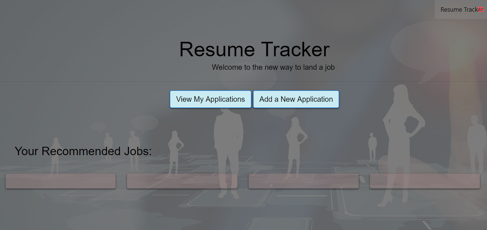

# Resume Tracker
##
* This is an app that tracks applications and where and when you applied to a job. It utilizes node mailer to send you reminders to follow-up on an interview three days after you have applied and reminds you if you have an interview coming up. The home page of the app also provides you with jobs recommended for you.

### Team Members
* Emily Raper
* Anjana Hengaju
* Dmitriy Petrenko
* Ben P

### Live App on Heroku
https://project-resume-1.herokuapp.com

### Technologies used
* HTML															
* CSS
* Bootstrap
* Javascript & jQuery
* NodeJS
* Express
* GitHub API
* MVC Structure
* Node-Mailer
* MomentJS

### Preview

